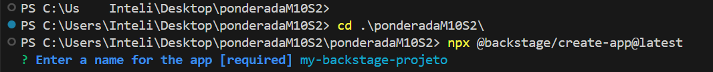
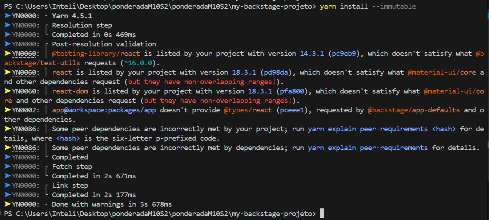
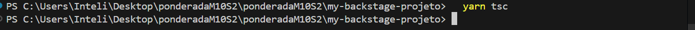

## Estrutura do Projeto

A estrutura de pastas e arquivos do repositório é a seguinte:

```plaintext
deploy-backstage-docker
├── backstage                 # Contém o projeto Backstage 

gerado                    # Pasta para armazenar screenshot

├── README.md                 # Documentação principal do projeto
├── app-config.production.yaml # Configuração de produção do Backstage
└── docker-compose.yml        # Arquivo para orquestrar os contêineres
```

## Pré-requisitos

- Docker
- Node.js (versão 20 ou superior)

## Instalação e Execução

### 1. Criação do App Backstage

Para criar o projeto Backstage, execute o comando:



```bash
npx @backstage/create-app@latest
cd backstage
```


### 2. Execução Local

Antes de iniciar a configuração Docker, execute o Backstage localmente para garantir que está funcionando corretamente:

```bash
yarn install
yarn dev
```


#### Capturas de Tela

- **Interface web do Backstage**:  


### 3. Configuração e Construção para Docker

Para preparar o Backstage para execução no Docker:

1. Instale as dependências com bloqueio de versão e compile o backend:
   ```bash
   yarn install --immutable
   yarn tsc
   yarn build:backend --config app-config.yaml --config app-config.production.yaml
   ```
   

   


2. Crie o arquivo `docker-compose.yml` com a seguinte configuração:

   ```yaml
   backstage:
  build: .
  ports:
    - "7007:7007"
  environment:
    POSTGRES_HOST: db                  
    POSTGRES_USER: your_username         
    POSTGRES_PASSWORD: 12345
    POSTGRES_DB: your_database          
  depends_on:
    - db

   ```

