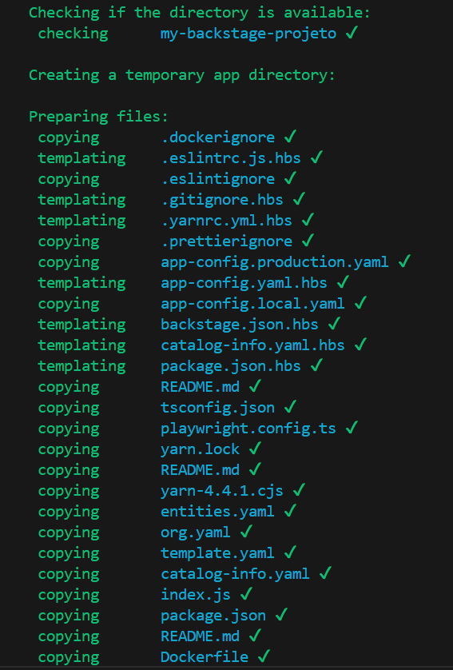
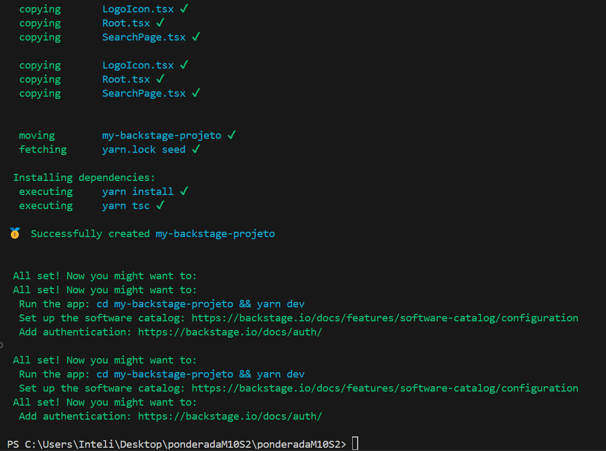
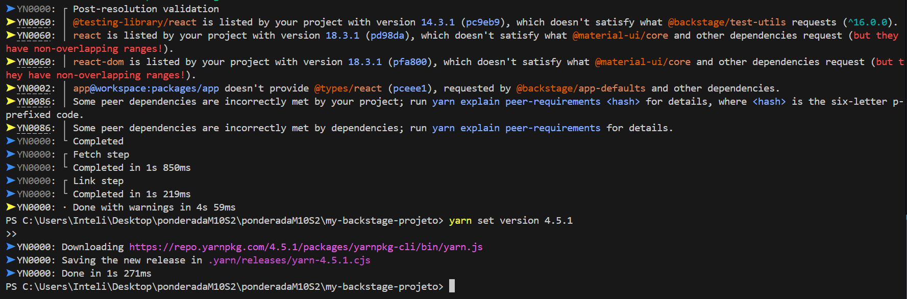
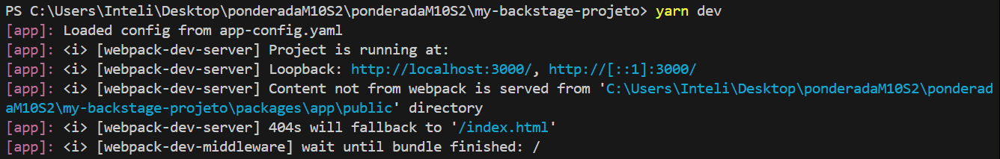
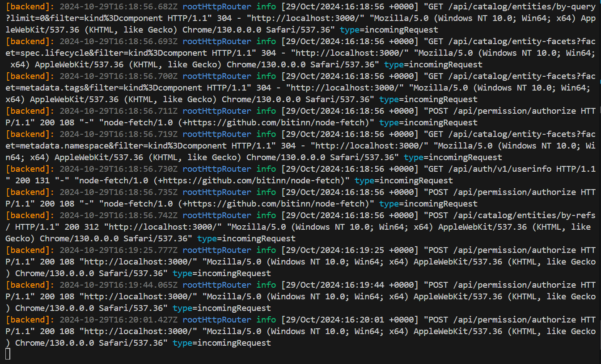
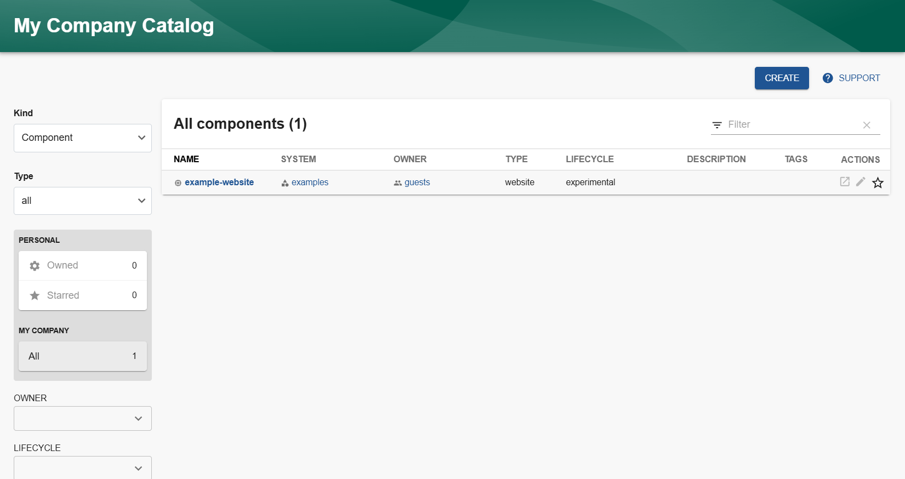
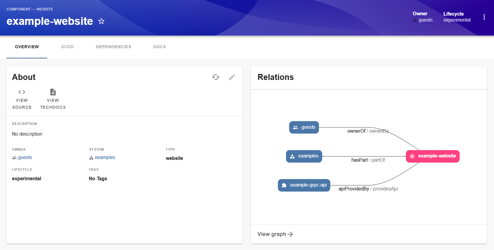

# Estrutura do Projeto

A estrutura de pastas e arquivos do repositório é a seguinte:

```plaintext
deploy-backstage-docker
├── backstage                 # Contém o projeto Backstage gerado
├── gerado                    # Pasta para armazenar screenshots
├── README.md                 # Documentação principal do projeto
├── app-config.production.yaml # Configuração de produção do Backstage
└── docker-compose.yml        # Arquivo para orquestrar os contêineres
```

## Pré-requisitos

- Docker
- Node.js (versão 20 ou superior)

## Instalação e Execução

### 1. Criação do App Backstage

Para criar o projeto Backstage, execute o seguinte comando:

```bash
npx @backstage/create-app@latest
cd backstage
```



### 2. Execução Local

Antes de iniciar a configuração Docker, execute o Backstage localmente para garantir que está funcionando corretamente:

```bash
yarn install
yarn dev
```






Após executar esses comandos, abra seu navegador e acesse `http://localhost:7007` para verificar se a aplicação está funcionando.

- **Interface web do Backstage**:  






### 3. Configuração e Construção para Docker

Para preparar o Backstage para execução no Docker:

1. Instale as dependências com bloqueio de versão e compile o backend:
   ```bash
   yarn install --immutable
   yarn tsc
   yarn build:backend --config app-config.yaml --config app-config.production.yaml
   ```
   Esses comandos instalam as dependências necessárias, compilam o código TypeScript e constroem o backend.

2. Crie o arquivo `docker-compose.yml` com a seguinte configuração:

   ```yaml
   version: '3.8'

   services:
     backstage:
       build: .
       ports:
         - "7007:7007"
       environment:
         POSTGRES_HOST: db                   # Endereço do banco de dados
         POSTGRES_USER: your_username         # Nome de usuário do banco de dados
         POSTGRES_PASSWORD: 12345             # Senha do banco de dados
         POSTGRES_DB: your_database           # Nome do banco de dados
       depends_on:
         - db

     db:
       image: postgres:latest                 # Imagem do PostgreSQL
       environment:
         POSTGRES_USER: your_username          # Nome de usuário do banco de dados
         POSTGRES_PASSWORD: 12345              # Senha do banco de dados
         POSTGRES_DB: your_database            # Nome do banco de dados
       ports:
         - "5432:5432"                         # Porta do banco de dados
   ```

3. Configure o arquivo `app-config.production.yaml` com as informações de conexão do banco de dados:

   ```yaml
   backend:
     database:
       client: pg
       connection:
         host: ${POSTGRES_HOST}
         port: 5432
         user: ${POSTGRES_USER}
         password: ${POSTGRES_PASSWORD}  # Adicione esta linha para especificar a senha
         database: ${POSTGRES_DB}
   ```

### Solução de Problemas

- **Erro ao conectar ao banco de dados**: Verifique se o container do PostgreSQL está rodando corretamente.
- **Erro de versão do Node.js**: Certifique-se de que está usando a versão correta do Node.js.

### Teste da Aplicação

Após a configuração do Docker, você pode iniciar os serviços com o seguinte comando:

```bash
docker-compose up
```

Acesse `http://localhost:7007` para verificar se a aplicação está funcionando corretamente.


## Referências

- [Documentação do Backstage](https://backstage.io/docs)
- [Documentação do Docker](https://docs.docker.com/)
